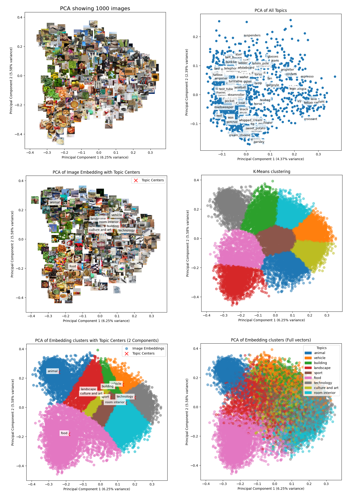

# Image Recommendation system

This research analysed [CLIP](https://openai.com/index/clip/) model for recommendation system. A zero-shot classification model that generates embeddings for both text and images. CLIP allows for semantic matching between these embeddings, enabling new approaches for item retrieval and recommendation.

## Datasets

[Things Dataset](https://things-initiative.org/) used for clip analysis and [Pinterest dataset](https://paperswithcode.com/dataset/pinterest) used for benchmarks

## Algorithm Benchmarks

<table>
  <caption>Comparison of Mean Embedding and Session-Based Approaches on Pinterest dataset.</caption>
  <thead>
    <tr>
      <th rowspan="2">Metric</th>
      <th rowspan="2">K</th>
      <th colspan="3">Mean Embedding</th>
      <th colspan="3">Session-Based</th>
    </tr>
    <tr>
      <th>no-split</th>
      <th>50% Split</th>
      <th>20% Split</th>
      <th>no-split</th>
      <th>50% Split</th>
      <th>20% Split</th>
    </tr>
  </thead>
  <tbody>
    <tr>
      <td rowspan="4"><strong>Precision@K</strong></td>
      <td>100</td>
      <td>0.083</td>
      <td>0.032</td>
      <td>0.014</td>
      <td>0.078</td>
      <td>0.032</td>
      <td>0.015</td>
    </tr>
    <tr>
      <td>50</td>
      <td>0.109</td>
      <td>0.040</td>
      <td>0.018</td>
      <td>0.094</td>
      <td>0.035</td>
      <td>0.017</td>
    </tr>
    <tr>
      <td>20</td>
      <td>0.135</td>
      <td>0.044</td>
      <td>0.022</td>
      <td>0.131</td>
      <td>0.043</td>
      <td>0.024</td>
    </tr>
    <tr>
      <td>10</td>
      <td>0.154</td>
      <td>0.021</td>
      <td>0.044</td>
      <td>0.149</td>
      <td>0.043</td>
      <td>0.020</td>
    </tr>
    <tr>
      <td rowspan="4"><strong>Recall@K</strong></td>
      <td>100</td>
      <td>0.213</td>
      <td>0.154</td>
      <td>0.159</td>
      <td>0.188</td>
      <td>0.133</td>
      <td>0.150</td>
    </tr>
    <tr>
      <td>50</td>
      <td>0.143</td>
      <td>0.094</td>
      <td>0.102</td>
      <td>0.114</td>
      <td>0.073</td>
      <td>0.088</td>
    </tr>
    <tr>
      <td>20</td>
      <td>0.074</td>
      <td>0.044</td>
      <td>0.052</td>
      <td>0.064</td>
      <td>0.037</td>
      <td>0.048</td>
    </tr>
    <tr>
      <td>10</td>
      <td>0.044</td>
      <td>0.027</td>
      <td>0.022</td>
      <td>0.038</td>
      <td>0.019</td>
      <td>0.022</td>
    </tr>
    <tr>
      <td rowspan="4"><strong>NDCG@K</strong></td>
      <td>100</td>
      <td>0.453</td>
      <td>0.259</td>
      <td>0.167</td>
      <td>0.448</td>
      <td>0.246</td>
      <td>0.167</td>
    </tr>
    <tr>
      <td>50</td>
      <td>0.447</td>
      <td>0.229</td>
      <td>0.146</td>
      <td>0.442</td>
      <td>0.219</td>
      <td>0.149</td>
    </tr>
    <tr>
      <td>20</td>
      <td>0.417</td>
      <td>0.185</td>
      <td>0.115</td>
      <td>0.426</td>
      <td>0.171</td>
      <td>0.119</td>
    </tr>
    <tr>
      <td>10</td>
      <td>0.383</td>
      <td>0.086</td>
      <td>0.147</td>
      <td>0.414</td>
      <td>0.138</td>
      <td>0.076</td>
    </tr>
    <tr>
      <td rowspan="4"><strong>Hit Rate@K</strong></td>
      <td>100</td>
      <td>0.969</td>
      <td>0.800</td>
      <td>0.579</td>
      <td>0.952</td>
      <td>0.762</td>
      <td>0.583</td>
    </tr>
    <tr>
      <td>50</td>
      <td>0.926</td>
      <td>0.645</td>
      <td>0.445</td>
      <td>0.917</td>
      <td>0.631</td>
      <td>0.464</td>
    </tr>
    <tr>
      <td>20</td>
      <td>0.762</td>
      <td>0.440</td>
      <td>0.293</td>
      <td>0.774</td>
      <td>0.405</td>
      <td>0.321</td>
    </tr>
    <tr>
      <td>10</td>
      <td>0.617</td>
      <td>0.181</td>
      <td>0.290</td>
      <td>0.679</td>
      <td>0.274</td>
      <td>0.167</td>
    </tr>
  </tbody>
</table>

### Mean embedding

> [Benchmark source code](./benchmark/src/benchmark_mean.py)

$$
\bar{E}_p = \frac{\sum_{i=1}^{N_p} w_i \cdot \bar{e}_i}{\sum_{i=1}^{N_p} w_i} \quad \text{and} \quad \bar{E}_n = \frac{\sum_{j=1}^{N_n} w_j \cdot \bar{e}_j}{\sum_{j=1}^{N_n} w_j}
$$

$$
\bar{E} = w_p \cdot \bar{E}_p - w_n \cdot \bar{E}_n
$$

### Session-Based embedding

> [Benchmark source code](./benchmark/src/benchmark_session.py)

$$
\alpha_1 = \frac{\cos(f_{\theta}(v_i), s_u) + 1}{2}, \quad \alpha_2 = 1 - \alpha_1
$$

$$
s_u^{t} = \alpha_1 s_u^{t-1} + \alpha_2 f_{\theta}(v_i)
$$
with the rest of the formulas shwon in the [Paper](https://scispace.com/pdf/a-personalised-session-based-recommender-system-with-5zjyjt67li.pdf)

## Conclusion

CLIP demonstrates potential for use in recommendation systems. Use of hybrid approach with both algorithms with use of this pre-trained model saves resources such as time and money.  
